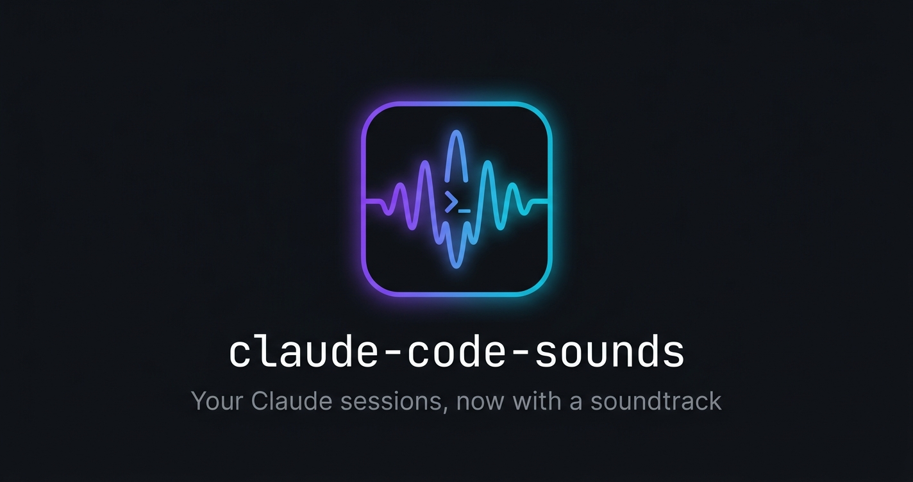
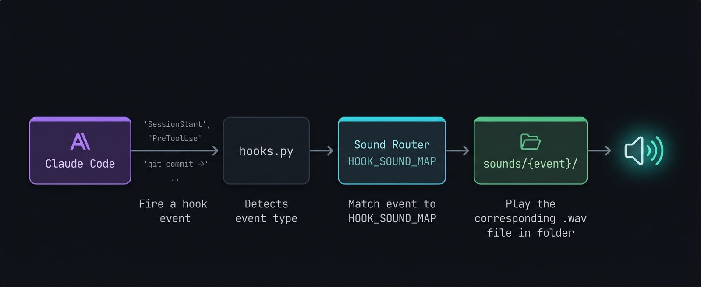

<div align="center">
  
</div>

<div align="center">

[](LICENSE)
[](https://github.com/dragon1086/claude-code-sounds/actions/workflows/validate.yml)


</div>

<div align="center">

**[English](README.md) · [한국어](README.ko.md) · [中文](README.zh.md) · [日本語](README.ja.md)**

</div>

Retroalimentación de audio para cada evento del ciclo de vida de Claude Code, impulsado por el sistema nativo de hooks. Incluye archivos de voz generados con ElevenLabs. Cambia cualquier sonido reemplazando un solo archivo.

## Cómo funciona

<div align="center">
  
</div>

## Instalación

### Opción A — Marketplace de plugins (recomendado)

```
/plugin marketplace add https://github.com/dragon1086/claude-code-sounds
/plugin install claude-code-sounds
```

Al seleccionar el alcance:

| Opción | Resultado |
|--------|-----------|
| **user (global)** ✅ | Los sonidos se reproducen automáticamente en todos los proyectos |
| project | Sin sonidos — ejecuta `setup-project` una vez por proyecto (ver abajo) |
| local | Igual que project, pero excluido de git (config personal) — también necesita `setup-project` |

> **Tras la instalación:** Reinicia Claude Code para activar los hooks.

#### Corrección para alcance project

Si elegiste project scope, ejecuta esto dentro del proyecto:

```bash
bash "$(find ~/.claude/plugins/cache/claude-code-sounds -name "claude-sounds.sh" | head -1)" setup-project
```

Reinicia Claude Code y los sonidos funcionarán.

---

### Opción B — curl

```bash
curl -fsSL https://raw.githubusercontent.com/dragon1086/claude-code-sounds/main/install.sh | bash
```

### Opción C — Clonar manualmente

```bash
git clone https://github.com/dragon1086/claude-code-sounds
cd claude-code-sounds && ./install.sh
```

> **Tras la instalación:** Reinicia Claude Code para activar los hooks.

## Requisitos

- Python 3
- macOS (`afplay`), Linux (`paplay` / `aplay` / `ffplay`), o Windows (`winsound` integrado)

## Cobertura de hooks

Los 27 eventos de hooks de Claude Code están conectados, más 6 eventos con alcance de agente:

| Categoría | Eventos |
|-----------|---------|
| Sesión | `SessionStart`, `SessionEnd`, `Setup` |
| Herramienta | `PreToolUse`, `PostToolUse`, `PostToolUseFailure`, `PermissionRequest`, `PermissionDenied` |
| Turno | `UserPromptSubmit`, `Stop`, `StopFailure`, `Notification` |
| Subagente | `SubagentStart`, `SubagentStop`, `TeammateIdle`, `TaskCreated`, `TaskCompleted` |
| Contexto | `PreCompact`, `PostCompact`, `InstructionsLoaded`, `ConfigChange` |
| Entorno | `CwdChanged`, `FileChanged`, `WorktreeCreate`, `WorktreeRemove` |
| MCP | `Elicitation`, `ElicitationResult` |

## Personalizar sonidos

Reemplaza cualquier archivo en `.claude/hooks/sounds/{event}/`:

```
.claude/hooks/sounds/stop/
└── stop.wav   ← reemplaza esto con tu propio sonido
```

El nombre del archivo debe coincidir con el nombre de la carpeta. Se admiten tanto `.wav` como `.mp3` (se intenta `.wav` primero).

### Especial: patrones de comandos Bash

Ciertos comandos bash activan sonidos dedicados. Por ejemplo, `git commit` reproduce `pretooluse-git-committing.wav` en lugar del genérico `pretooluse.wav`.

Agrega tus propios patrones en `hooks.py`:

```python
BASH_PATTERNS = [
    (r'git commit', "pretooluse-git-committing"),  # incluido por defecto
    (r'npm test',   "pretooluse-npm-testing"),      # agrega el tuyo propio
    (r'rm -rf',     "pretooluse-danger"),
    (r'git push',   "pretooluse-git-pushing"),
]
```

Cada patrón necesita un archivo correspondiente en `sounds/pretooluse/pretooluse-{name}.wav`.

## Deshabilitar hooks

Crea `.claude/hooks/config/hooks-config.local.json` (ignorado por git):

```json
{
  "disablePostToolUseHook": true,
  "disableLogging": true
}
```

Consulta `hooks/config/hooks-config.local.json.example` para ver todas las opciones.

## Paquetes de sonido

Cambia todos los sonidos a la vez:

```bash
# paquetes integrados
claude-sounds use silent    # deshabilita todos los sonidos sin eliminar los hooks

# paquetes de la comunidad (repositorios externos de GitHub)
claude-sounds use https://github.com/someone/star-trek-sounds
```

Consulta [PACKS.md](PACKS.md) para ver los paquetes de la comunidad. Para contribuir con un paquete, consulta [packs/README.md](packs/README.md).

## Sonidos de agentes

Las sesiones de subagentes pueden reproducir sonidos distintos. Conecta los hooks en el frontmatter de tu agente:

```yaml
---
name: my-agent
hooks:
  PreToolUse:
    - type: command
      command: python3 $CLAUDE_PROJECT_DIR/.claude/hooks/scripts/hooks.py --agent=my-agent
      async: true
      timeout: 5000
  Stop:
    - type: command
      command: python3 $CLAUDE_PROJECT_DIR/.claude/hooks/scripts/hooks.py --agent=my-agent
      async: true
      timeout: 5000
---
```

Los archivos de sonido van en `agent_pretooluse/`, `agent_stop/`, etc.

## Desinstalar

```bash
./uninstall.sh
```

## Créditos

Inspirado en [shanraisshan/claude-code-best-practice](https://github.com/shanraisshan/claude-code-best-practice), que demostró por primera vez cómo integrar retroalimentación de audio en los hooks de Claude Code. Este proyecto extrae esa idea en un plugin independiente e instalable con cobertura completa de hooks, paquetes de sonido y soporte multiplataforma.

## Licencia

MIT
